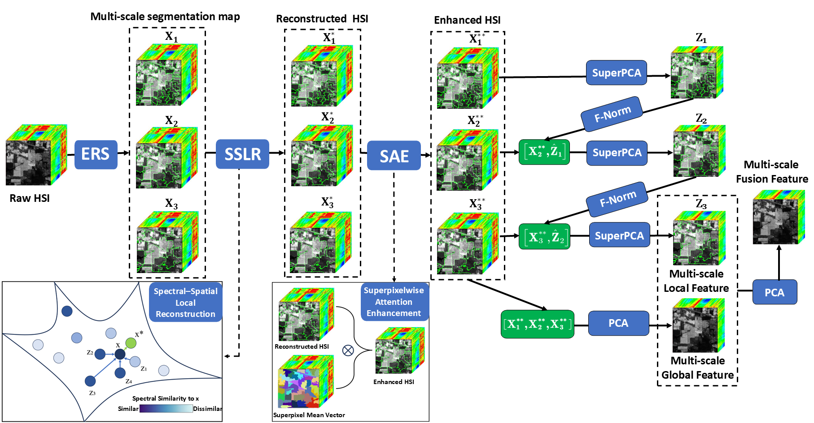
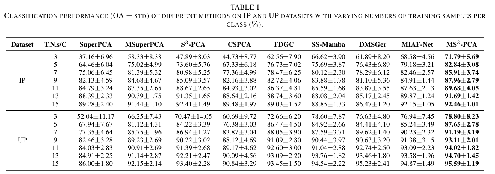

# MS3-RPCA
The code is for the work: Multi-scale Superpixelwise Spectral–Spatial Recursive PCA for Hyperspectral Image Feature Extraction

Run 'demo_MS3RPCA.m' to reproduce the experimental results reported in the paper.

All experiments were implemented and evaluated in MATLAB R2022b. 

OAs of the proposed method and comparative algorithms on two hyperspectral datasets under different training sample settings.

If you need these two datasets (Indian Pines, University of Pavia), please feel free to contact me. Or you can download them from https://www.ehu.eus/ccwintco/index.php/Hyperspectral_Remote_Sensing_Scenes

